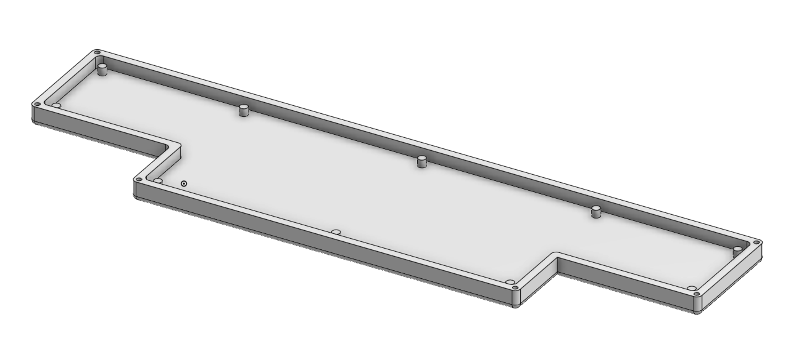
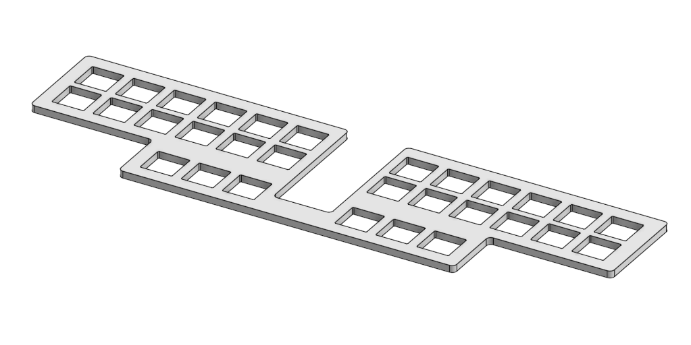
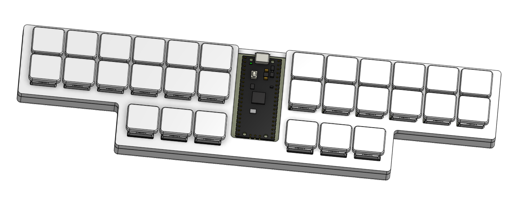

# sten0

sten0 is a minimalist stenography keyboard. it was meant to defeat the industry standard Uni v4 which is overpriced and unsymmetrical. it uses a 2-layer PCB and KMK firmware that converts to stenography with the industry-standard Plover firmware. 

### what is steno?
traditional stenography keyboards are keyboards used by transcribers in a courtroom to type extremely fast. hobbyists and now companies have created their own versions of steno keyboards. one can easily get 200 wpm using steno, demonstrated in the video here: https://www.youtube.com/watch?v=l8SWkR5y774. 

the company, stenokeyboards.com, is the leader of the steno industry with products that are pretty cool, but extremely expensive. worst of all, they are closed source. i wanted to make something better for cheaper.

### PCB + Schematic
I used KiCad 10.0 for the PCB design. The silkscreen art was created using https://www.fontspace.com/ and inputted to KiCad using the built-in Image Convertor tool.

### CAD
I used Onshape for the entire CAD. It features a front plate and a back plate. It is only 255.4 mm wide at its widest point, making it printable on a standard Bambu Lab A1 or any Bambu Lab 3d printer. Can be viewed here! https://cad.onshape.com/documents/f60da929d98268854f5791b9/w/b980d7f138533dbdb870e5ad/e/3b5277e683bbd7090a7e44ca?renderMode=0&uiState=6a166c62bcc75bd5e84998b5

### Firmware
The keyboard uses KMK. There is a standard keyboard matrix that links to standard QWERTY layout which will be converted to Steno layout with Plover firmware.

### BOM
A detailed Bill of Materials can be found at https://docs.google.com/spreadsheets/d/1TjUF5DwXCz-duM485mYQtrJNJa8_saizqugbLS9kPO8/edit?gid=0#gid=0!

### Credits
Big thanks to Hack Club for funding the project + providing a LOT of help!
