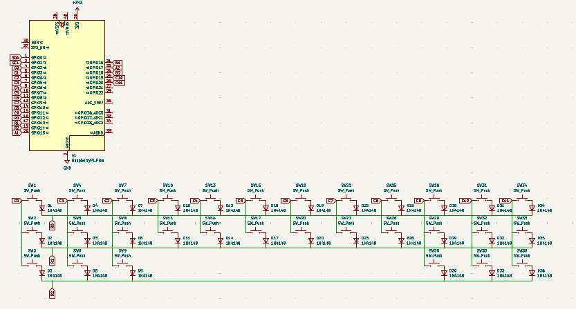
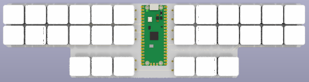

# sten0
sten0 is a minimalist, cheap steno board. it was meant to defeat the industry standard Uni v4 which is overpriced and unsymmetrical. it uses a 2-layer PCB and KMK firmware that converts to stenography with the industry-standard Plover firmware. 

### what is steno?
traditional stenography keyboards are keyboards used by transcribers at justices to type extremely fast. hobbyists and now companies have created their own versions of steno keyboards. one can easily get 200 wpm using steno, demonstrated in the video here: https://www.youtube.com/watch?v=l8SWkR5y774. 

the company, stenokeyboards.com, is the leader of the steno industry with products that are pretty cool, but extremely expensive and not that good-looking. worst of all, they are closed source. i wanted to make something better for cheaper.

### PCB + Schematic
I used KiCad 10.0 for the PCB design. The silkscreen art was created using https://www.fontspace.com/ and inputted to KiCad using the built-in Image Convertor tool.

### CAD
I used Onshape for the entire CAD. It features a front plate AND a back plate. 

### Firmware
There is a matrix that links to QWERTY layout which will be converted to Steno layout with Plover. 

### BOM
A detailed Bill of Materials can be found at https://docs.google.com/spreadsheets/d/1TjUF5DwXCz-duM485mYQtrJNJa8_saizqugbLS9kPO8/edit?gid=0#gid=0!

### Credits
Big thanks to Hack Club for funding the project + providing a LOT of help!
